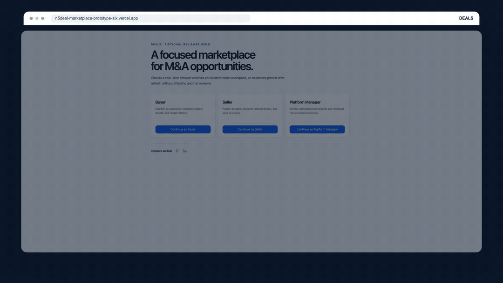

# Deals Marketplace Prototype

> A focused M&A marketplace prototype for discovering fit between acquisition mandates and assets — with explainable matching, persisted inquiries, and a manager moderation loop.

[](https://deals-marketplace-prototype.vercel.app)
[](https://deals-marketplace-prototype.vercel.app/api/health)
[](https://nextjs.org/)
[](https://www.typescriptlang.org/)

**[Open the live prototype →](https://deals-marketplace-prototype.vercel.app)**

**[Watch the product demo on YouTube →](https://www.youtube.com/watch?v=g0Mr5PWv964)**



_A real Buyer flow from the deployed fictional reviewer workspace: 20 assets → 2 EMI results → an explainable match → a persisted inquiry._

Built first for a time-limited technical review; kept as a compact engineering portfolio case study. The fastest path is: open the demo, follow the tour, then inspect the architecture and source behind each decision.

## See the product in two minutes

The prototype is organized around one complete marketplace loop:

```text
Buyer mandate  →  explainable asset fit  →  persisted inquiry
Seller asset   →  buyer discovery       →  persisted inquiry
                         ↓
             manager moderation → marketplace state changes
```

1. Continue as **Buyer**. Update the acquisition mandate, filter Assets, open a match explanation, and contact a Seller.
2. Switch to **Seller**. Publish an Asset, use it as context, filter Buyers, and contact one.
3. Switch to **Platform Manager**. Search participants, preview a suspension consequence, suspend a Seller, and confirm the Seller's Assets leave the Buyer marketplace.
4. Refresh after mutations to see that the state is persisted.

All people, companies, Assets, prices, and inquiries are fictional.

## What is implemented

| Role             | Core flow                                                              | Product detail                                        |
| ---------------- | ---------------------------------------------------------------------- | ----------------------------------------------------- |
| Buyer            | Maintain an acquisition profile, browse/filter Assets, contact Sellers | Match score, confidence, and human-readable reasons   |
| Seller           | Publish an Asset, browse/filter Buyers, contact Buyers                 | Asset validation and contextual contact               |
| Platform Manager | Inspect participants and Assets, search/filter, suspend/restore        | Preview impact before moderation and auditable action |

That means the reviewer can test the happy path and the uncomfortable edges: duplicate submissions, self-contact, stale sessions, wrong-role routes, malformed URL filters, suspended participants, cross-workspace IDs, empty states, recovery states, mobile layouts, and concurrent publication/workspace races.

## Smart features without runtime AI risk

- **Explainable Smart Match** is deterministic and inspectable: the same buyer mandate and asset facts produce the same score, confidence, and reasons.
- **Smart Validation** catches contradictory acquisition criteria and incomplete or low-quality Asset data before it reaches the marketplace.
- The prototype deliberately avoids a runtime LLM dependency. This keeps reviewer-visible behavior reproducible and makes authorization and matching decisions easy to inspect.

## Architecture and key decisions

One Next.js App Router application owns the UI, server actions/queries, policy checks, and persistence. PostgreSQL is the source of truth; Prisma provides the relational model and transactions.

- A signed `httpOnly` cookie identifies an isolated demo workspace and active persona.
- The server resolves the session, reloads the User, checks role/status/workspace, and scopes every read and mutation.
- The relational core is intentionally small: `DemoWorkspace`, `User`, `BuyerProfile`, `Asset`, `ContactRequest`, and `ModerationAction`.
- Search uses bounded relational filters and pagination. A dedicated search service is intentionally deferred until real volume requires it.
- Suspension is soft and auditable; suspended Sellers' published Assets are excluded from Buyer discovery.

**Why it matters:** the UI is easy to exercise, while the server boundary makes each result traceable to a session, policy check, query, or transaction. More detail: [`docs/architecture.md`](docs/architecture.md).

## Local launch

Requirements: Node `24.x`, pnpm `11.17.0`, and a PostgreSQL database.

```bash
corepack enable
pnpm install --frozen-lockfile
cp .env.example .env
pnpm db:generate
pnpm db:deploy
pnpm dev
```

Open [http://localhost:3002](http://localhost:3002).

The server configuration expects these variable names: `DATABASE_URL`, `DIRECT_URL`, `SESSION_SECRET`, `DEMO_MODE_ENABLED`, `MAX_DEMO_WORKSPACES`, and `VERCEL_GIT_COMMIT_SHA`. Keep values local; never commit `.env` files.

## Verification

```bash
pnpm verify
pnpm test:e2e
```

The consolidated verification gate covers project/toolchain policy, lint, formatting, types, unit/integration tests, Prisma generation, production build, and whitespace checks. The Playwright suite covers the Buyer, Seller, Manager, recovery, security, creator-signature, and responsive journeys. Run the gates locally to reproduce the evidence; no unverified test counts are claimed here.

## Assumptions and trade-offs

- Demo persona selection is intentionally prototype authentication, not production identity or invitations.
- Contact is a persisted inquiry, not realtime chat, email delivery, or notifications.
- Money is normalized to integer EUR.
- Removal is soft and auditable.
- Demo workspaces are isolated and short-lived; the free hosting/database tiers are not an availability SLA.
- No real or confidential deal data should be entered.

## AI-assisted development, with ownership retained

OpenAI Codex assisted with repository analysis, implementation, test authoring, debugging, and verification. The owner supplied the product brief, scope, infrastructure choices, and deployment access. AI suggestions were narrowed when they introduced unnecessary infrastructure or reduced inspectability; the shipped matching and validation path remains deterministic and reviewable.

See [`docs/ai-usage.md`](docs/ai-usage.md).

## With more time

1. Replace demo persona authentication with organization identity, invitations, and role administration.
2. Add a secure data-room/NDA workflow and richer messaging/notifications.
3. Add PostgreSQL full-text/trigram search after measuring real marketplace volume.
4. Add optional multilingual UI and carefully bounded LLM assistance with explicit human review.
5. Add production observability, rate limiting, retention controls, and a formal moderation policy.

## Creator

Built by **Yevgeniy Sorokin**.

[](https://github.com/ewgenij87snwork)
[](https://www.linkedin.com/in/yevgeniy-sorokin-829b7b18a/)

## After the review

For a public demo, disable `DEMO_MODE_ENABLED`, enable deployment protection, or remove the Vercel/database projects after review.
